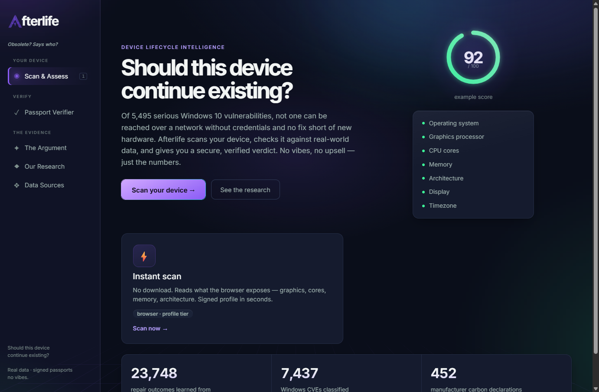
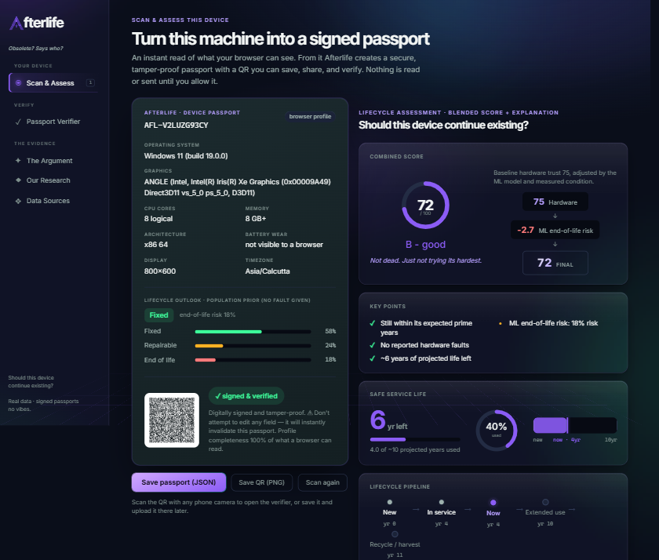

# AfterLife — Device Lifecycle Intelligence

**Should this device continue existing?**

AfterLife scans a laptop or phone in the browser, checks it against real repair,
security and carbon data, and gives a **keep / repair / sell / recycle** verdict
with the evidence behind it. The result is sealed into a **digitally signed
passport** with a QR code that anyone can verify later.

> Every number on screen is computed from data. Nothing is typed in by hand, and
> the written summary only explains the numbers. It can never change them.



---

## The problem

Millions of working devices are thrown away because nobody can tell whether
they are still worth keeping. "Your operating system is out of support" is
often treated as a reason to replace a machine, even though most of a laptop's
lifetime carbon is spent *making* it, and most serious security flaws need an
attacker who is already on the device.

AfterLife gives people a verdict they can check instead of a guess.

## SDG alignment

| Goal | Target | How AfterLife contributes |
|---|---|---|
| **SDG 12** Responsible Consumption and Production (primary) | 12.5: reduce waste through prevention, repair and reuse | Makes keep or repair the informed default, so fewer working devices are discarded early |
| **SDG 13** Climate Action (primary) | 13.3: awareness of climate change mitigation | Shows the carbon cost of a replacement at the moment the keep-or-replace decision is made |
| **SDG 9** Industry, Innovation and Infrastructure | 9.4: resource-use efficiency | Data-driven tooling for a circular approach to devices |
| **SDG 11** Sustainable Cities and Communities | 11.6: reduce municipal waste | Less e-waste entering the urban waste stream |

---

## What it does (Sprint 1)

| Feature | What the user sees |
|---|---|
| **Instant scan** | After a consent screen, the browser reads the OS, graphics, CPU cores, memory, architecture, display and timezone. No download. |
| **Lifecycle assessment** | A combined score out of 100, a grade, and a waterfall showing every point added or taken away |
| **ML end-of-life risk** | A model trained on real repair outcomes estimates how likely a device like this is to be beyond repair |
| **Remaining service life** | Estimated years of safe use left, and where the device sits in its lifecycle |
| **Lifecycle pathways** | Five options (keep, keep with hardening, repurpose, sell, recycle), each scored, with the best fit marked |
| **Carbon trade-off** | How many years a new machine would need to repay the carbon spent building it, on the user's own electricity grid |
| **Signed passport + QR** | The result, signed with Ed25519 inside a W3C Verifiable Credential envelope. Can be saved as JSON or as a QR image. |
| **Passport Verifier** | Upload a passport's QR image or paste its JSON to check it was issued by AfterLife and has not been edited |
| **Evidence pages** | *The Argument*, *Our Research* and *Data Sources*: the findings and datasets behind every verdict |



## How it works

```
  Browser (React + Vite)                         Backend (FastAPI, Python)
  ──────────────────────                         ─────────────────────────
  1. Scan    reads what the browser exposes
             + age / fault from the user  ──►  /api/scan-passport
                                                  runs the ML model, signs the passport
  2. Assess  sends the signed facts       ──►  /api/assess
                                                  score, grade, years, pathways, carbon
  3. Show    passport card + dashboard
  4. Verify  passport JSON or QR          ──►  /api/verify
                                                  checks the Ed25519 signature
  Evidence pages                          ──►  /api/thesis  /api/findings  /api/sources
                                                  read from computed files in app_data/
```

### The machine-learning model

- **Data:** Open Repair Alliance repair events, filtered to five IT product
  categories with a known outcome: **23,748 records** from **8** repair
  organisations. Each record is labelled by a technician as *Fixed*,
  *Repairable* or *End of life*.
- **Models compared:** Logistic Regression, Random Forest and XGBoost
  (`scripts/train_lifecycle.py`).
- **Honest evaluation:** whole repair organisations are held out in each fold
  (4-fold grouped validation), so the model is scored on venues it never saw.
- **Selection:** on **End-of-life recall**, not accuracy. A majority-class
  baseline scores well on accuracy while catching zero end-of-life devices,
  which is exactly the failure this product exists to prevent.
- **Calibration:** the risk is calibrated so it behaves like a real probability
  (calibration error **0.025**), because it is subtracted from the device's score.

### Why the passport can be trusted

The passport is signed with an **Ed25519** private key that only the server
holds. Changing even one character breaks the signature. The verifier also
checks *which* key signed it. A forger could sign a fake passport with their
own key, so a valid signature alone is never reported as "issued by AfterLife".

---

## Getting started

Full step-by-step instructions are in **[docs/SPRINT1_GUIDE.md](docs/SPRINT1_GUIDE.md)**.

Short version (Windows, two Command Prompt windows):

```bat
:: one-time setup
py -3.12 -m venv venv
venv\Scripts\python -m pip install -r requirements.txt
cd frontend && npm install && cd ..

:: terminal 1: backend on http://localhost:8000
set PYTHONPATH=.
venv\Scripts\python -m uvicorn api.main:app --port 8000

:: terminal 2: frontend on http://localhost:5173
cd frontend
npm run dev
```

API documentation is generated automatically at http://localhost:8000/docs.

## Running the tests

```bat
set PYTHONPATH=.
venv\Scripts\python -m pytest          :: backend: 260 tests

cd frontend
npm test                               :: frontend: 35 tests
```

The backend tests drive the real API through FastAPI's test client. They check
that the figures on the research pages match the data on disk, that a tampered
passport fails verification, and that a missing measurement is never reported
as a healthy one.

---

## Project structure

```
afterlife/      core library
  assessment.py     blended score, remaining years, key points, summary
  pathways.py       the five lifecycle pathways
  predict.py        loads the trained model and predicts
  passport.py       builds, signs and verifies passports (Ed25519)
  grid.py           carbon break-even on a country's grid
  embodied_carbon.py  manufacturer carbon declarations
  device_support.py / esu.py   OS security-support dates
  hardening.py / mitigation.py CVE classification behind the security finding
  geo.py            timezone -> country (no IP address is used)
  sources.py        provenance and freshness for every dataset
api/main.py     FastAPI backend
frontend/       React + Vite website
scripts/        data pipeline and model training (produce app_data/ and models/)
app_data/       computed data files the API reads
models/         trained model + metrics
tests/          backend tests
docs/           guides and screenshots
```

## Data sources

| Source | Used for | Licence |
|---|---|---|
| [Open Repair Alliance](https://openrepair.org/open-data/) | Training the model; repair success rates | CC BY-SA 4.0 |
| [National Vulnerability Database](https://nvd.nist.gov/) | Windows 10/11 CVE corpus | Public domain |
| [CISA KEV](https://www.cisa.gov/known-exploited-vulnerabilities-catalog) | Which flaws were really exploited | Public domain |
| [FIRST EPSS](https://www.first.org/epss/) | Exploit probability per CVE | Free for any use, attribution requested |
| [Boavizta](https://boavizta.org/) | Manufacturer carbon declarations | CC BY-SA |
| [Our World in Data](https://ourworldindata.org/) | Grid carbon intensity per country | CC BY 4.0 |
| [endoflife.date](https://endoflife.date/) | OS security-support dates | CC BY-SA 4.0 |
| [Steam Hardware Survey](https://store.steampowered.com/hwsurvey) | How fast Windows versions are retired | Public |
| [Alibaba fail-slow dataset](https://tianchi.aliyun.com/dataset/144479) | Drive degradation versus age | Open dataset, research use |

The *Data Sources* page in the app shows each one with its row count and how
fresh it is.

## Green computing practices

- **Instant scan runs in the browser.** Nothing to download or install.
- **Load only what is used.** The research, verifier and sources pages load
  only when they are opened, not with the first page.
- **Work done once.** The model is trained offline and loaded once per server
  (`functools.lru_cache`), not on every request.
- **Precomputed evidence.** Research figures are computed by scripts ahead of
  time and served as small files, instead of being recalculated per visitor.
- **Small dependency footprint.** The frontend ships five runtime libraries.

## Known limitations

- A browser cannot read battery wear, disk health or Windows 11 eligibility, so
  an instant scan is built on less evidence than a full hardware scan would be.
- Open Repair Alliance data comes from community repair events, mostly in
  Europe. It is not a sample of all devices.
- The signature proves a passport was *not edited since issue*. It does not
  prove the browser reported the hardware truthfully.

## Roadmap

- **Sprint 2:** deep hardware scan (battery, disk health, Windows 11 check),
  accounts with saved scans, repair-outcome and repair-rights evidence, resale
  estimate, live deployment
- **Sprint 3:** EU repairability grade (EPREL), PDF passport, plain/technical
  view, measured before-and-after green optimisation, user testing

---

**Author:** Ruhin Zaidi · BCA (Honours), Semester 7 · SDG GreenTech 2026

Licensed under the [MIT License](LICENSE). Datasets keep their own licences (above).
